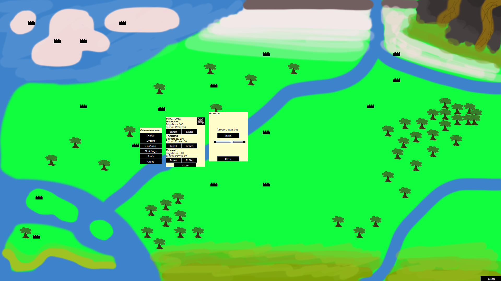

# Diplomatic game
A strategic game focused on diplomacy and city building.



## Installation
### Play game
1. To run game first make sure Java is installed.
2. Download and launch the JavaOO.jar file.

### Development
Clone this repo.
```
git clone https://gitlab.liu.se/tdde25/ctf https://github.com/chrnas/tank-ai-game.git
cd ctf
```
Edited and compiled in IntellJ IDEA 2024 using Main.java as main file.

## Usage

Execute the diplomaticGame.jar file and play the game.

## Contributing

Project is finished however contains a lot of bugs and missing content this could be improved and added.

## License

[MIT](https://choosealicense.com/licenses/mit/)
